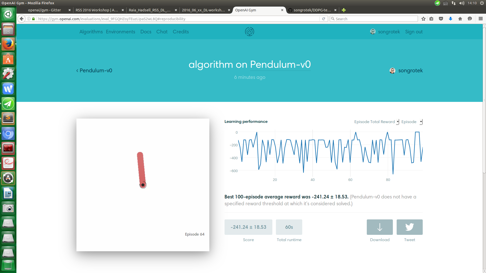

# DDPG-tensorflow

Implementing DDPG on OpenAI Reimplementing DDPG from Continuous Control with Deep Reinforcement Learning based on OpenAI Gym and Tensorflow

[http://arxiv.org/abs/1509.02971](http://arxiv.org/abs/1509.02971)

## Reference
1 [https://github.com/rllab/rllab](https://github.com/rllab/rllab)

2 [https://github.com/MOCR/DDPG](https://github.com/MOCR/DDPG)

3 [https://github.com/SimonRamstedt/ddpg](https://github.com/SimonRamstedt/ddpg)

## Disclaimer

The core implementation of the algorithm is mainly based on [https://github.com/SimonRamstedt/ddpg](https://github.com/SimonRamstedt/ddpg)